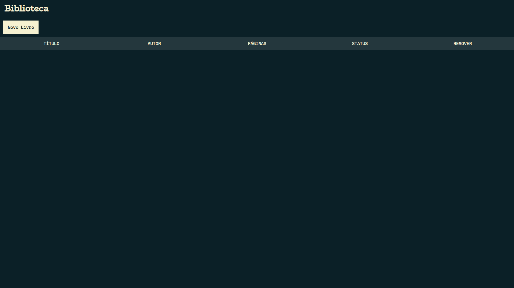
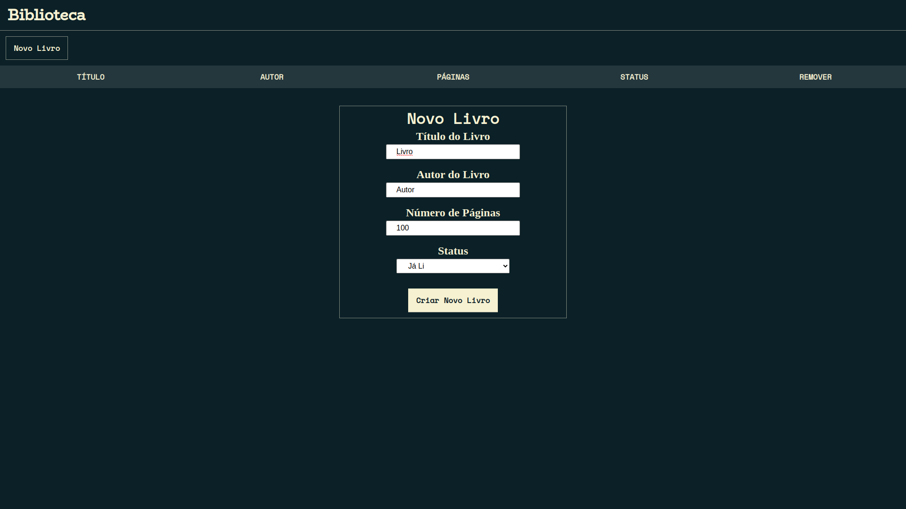
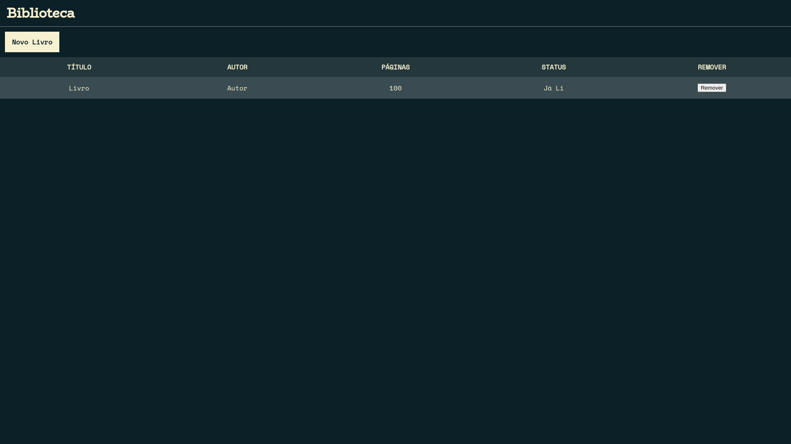

<h1 align="center">:books:<a href="https://jocowski.github.io/Biblioteca/" alt="Site Biblioteca"> Biblioteca</a></h1>

<h3 align="center">:blue_book: Uma biblioteca para salvar sua lista de livros. :orange_book:</h3>

<h4 align="center">Concluído</h4>

Tabela de conteúdos
=================
<!--ts-->
   * [Funcionalidades](#funcionalidades)
   * [Screenshots](#screenshots)
   * [Tecnologias](#tecnologias)
   * [Autor](#autor)
   * [Licença](#licença)
<!--te-->

<h2 id="funcionalidades">⚙️ Funcionalidades</h2>

- [X] Adicionar livros.
- [X] Remover livros.
- [X] Salvar os livros.
- [ ] Compartilhar livros.

<h2 id="screenshots">:camera: Screenshots</h2>

<h2 id="tecnologias">🛠 Tecnologias</h2>

- JavaScript
- CSS
- HTML

<h2 id="autor">:smiley: Autor</h2>

<b>João Marcos</b></a>

<h2 id="licença">📝 Licença</h2>

Este projeto esta sobe a licença [MIT](LICENSE).